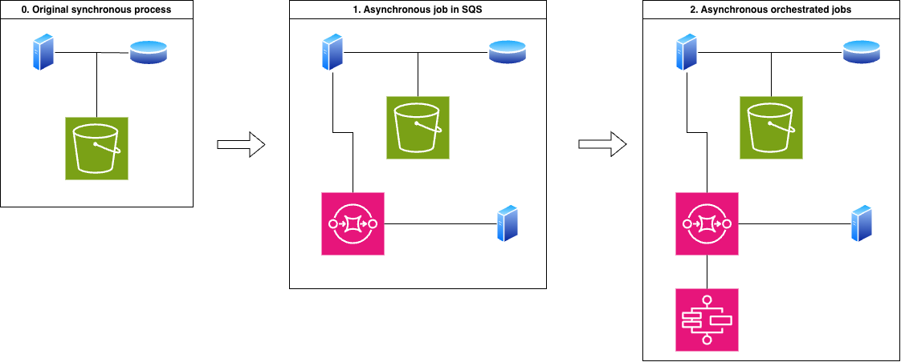

As we have all come to learn, there is rarely just one solution to an engineering problem. Decisions are almost always driven by current business needs, financial constraints, team capacity, and looming deadlines. There are a lot of dimensions to every architectural choice.

Let's take a look at a decent-sized project I had the privilege of working on recently; one shaped by many of these exact trade-offs.

## The Problem

I was on a team responsible for a system that handled website snapshots. This system gave website owners two core features: the ability to take an instant backup at any time, and the ability to restore from that snapshot whenever needed.

You can think of it like a typical versioning system. In `git` terms, creating a snapshot is like making a commit; if something goes wrong, you can restore your environment back to that specific point in time.

Our main challenge was scale. The original restore system was built as a synchronous process. When a restore failed (usually due to timeouts), the only path forward was opening a customer support ticket. A support agent would then trigger the restore through an internal tool designed to run longer background tasks.

This manual fallback worked for a while, but failures started compounding as we took on larger enterprise customers. Beyond the technical failures, relying on manual intervention from support was clearly not going to scale.

It’s a story as old as software engineering: a system built for early-stage business needs required modernization to support the company's growth.

## Milestone 1: Asynchronous Processing

At the time, our team was strapped for resources. The engineering effort for this project consisted of just myself and a mid-level full-stack engineer.

Because timeouts on synchronous site restores were our primary blocker, moving to an asynchronous, queue-based architecture was the natural first step. Fortunately, our engineering organization had already adopted AWS SQS for newer services, giving us a proven pattern to follow. Using Pulumi, I provisioned a new SQS queue and consumer workers. Switching over was straightforward: we updated the application to route incoming restore requests to the new SQS-backed endpoint behind a feature flag.

On the frontend, the required UI updates were minimal and aligned easily with our existing design system. Our product designer signed off on the approach, and the mid-level engineer handled the frontend implementation seamlessly.

We took a long-running, blocking process that routinely timed out in the UI and moved it safely behind SQS where it could finally run to completion... almost always.

## Milestone 2: Workflow Orchestration

While SQS was a massive upgrade, improved observability into the new system revealed a granular view of secondary failures within the restore pipeline itself.

Right around this time, a senior engineer joined our team. Together, we reviewed the system architecture and observability metrics, quickly agreeing that the monolithic restore task needed to be broken down into discrete steps.

We considered a few tools our team had used in the past for data orchestration: Apache Airflow, AWS Step Functions, and Temporal. Although our data engineering team used Airflow for data warehousing, our application codebase was written in TypeScript, making Python-centric Airflow a poor fit. Both Step Functions and Temporal offered strong TypeScript support and provided the orchestration capabilities we needed.

Because two of us had prior experience with Step Functions, it had an immediate advantage. However, Temporal was new to the entire team, and we wanted to thoroughly evaluate both options. We split into two parallel research spikes: the mid-level engineer and I built a proof-of-concept (POC) with Temporal, while the senior engineer built a POC using Step Functions.

Step Functions integrated naturally into our existing infrastructure since we were already heavily invested in AWS, though it required a fair amount of configuration work.

On the other hand, we thoroughly enjoyed working with Temporal. The documentation was excellent, the APIs were intuitive, and the developer experience felt smooth. The main trade-off was operational: adopting it meant deciding between self-hosting the cluster or paying for Temporal Cloud.

Ultimately, we recommended Temporal and presented our proposal to infrastructure leads and engineering leadership. However, the proposal was declined due to the risk of introducing another third-party vendor dependency and our team's lack of operational experience running Temporal.

With the architectural review complete, we proceeded with Step Functions. The core work involved breaking the monolithic process into small, idempotent steps that formed a cohesive workflow for site restores. This made the entire pipeline significantly more resilient: if an individual step failed, it could be retried independently, and when unrecoverable errors occurred, engineers had a much smaller surface area to debug.

Success! Site restores were now fully asynchronous, resilient, and observable down to individual sub-tasks.

## Trade-offs

Engineering trade-offs ultimately determine what gets shipped. We were a lean team of two to three engineers depending on the project phase. While we loved the developer experience of Temporal, managing a new vendor contract and onboarding the broader team to maintain new infrastructure wasn't the right risk profile for us at the time.

By evaluating our constraints realistically, we delivered a robust service within our existing ecosystem; leaving the architecture in a significantly healthier state than we found it.

#### Meta

- Photo by Diva Plavalaguna from Pexels: https://www.pexels.com/photo/close-up-photo-of-people-holding-puzzle-pieces-6147381/
- Simple diagram is by me.
