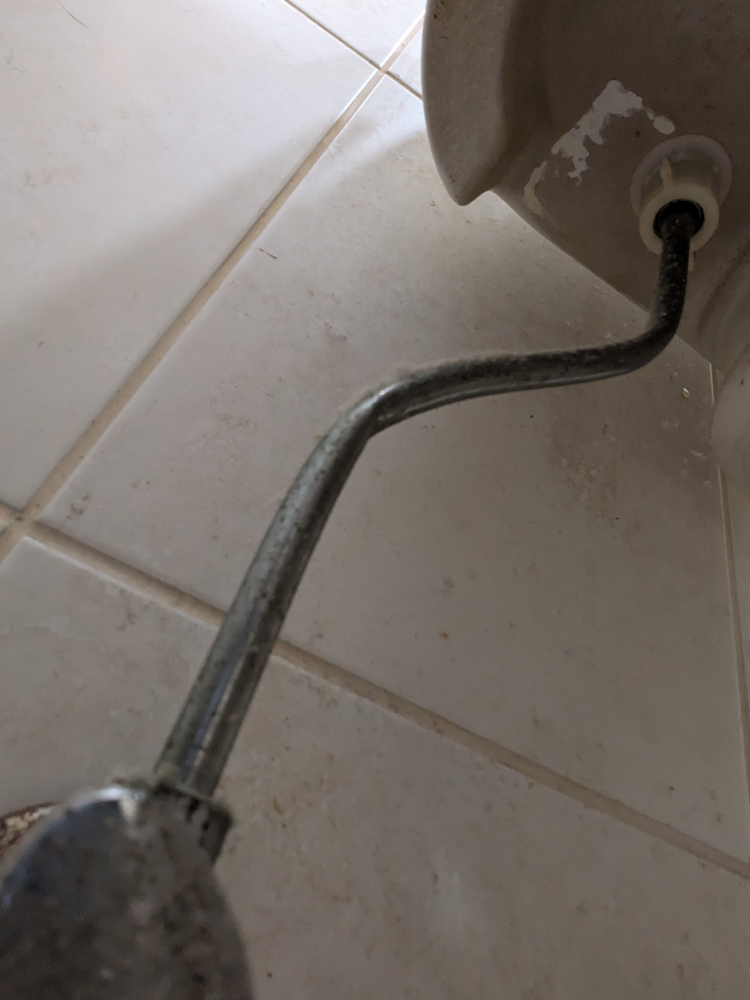

I was standing in my bathroom, staring at the toilet’s water supply line, wondering what the person who installed it was thinking. My only prior experience with toilet plumbing involved flexible, braided lines and the rigid line in front of me was definitely not braided. Nonetheless, I understood the fundamental system: water flows from the wall, through the line, and into the fill valve. Simple enough.
This was me a few weeks ago. Our toilet’s fill valve was malfunctioning and needed to be replaced. I had replaced one before at a previous home; it isn't a complex job, but it requires a basic understanding of the underlying system to get everything flowing properly again.
Don't worry, I won't bore you with a complete DIY plumbing manual. But as I worked, I couldn't stop thinking about the striking similarities between plumbing systems and software architectures.

## Understand Your Inputs and Controls

Water flow powers modern plumbing; data flow powers software. Understanding the inputs, throughput, and control points of your system allows you to manage it safely. Just as I turned off the main shut-off valve to prevent a flood before removing the old fill valve, software systems require clear control points, like drain queues, feature flags, or maintenance windows, before you perform maintenance on critical path components.

### Work Through the Unknowns

"What the heck?" I thought after examining the rigid water line. I was frustrated at first, but I paused and reminded myself that while I’m not a professional plumber, the underlying system logic hadn't changed, the components were just unfamiliar. I looked at the system as a whole, isolated the single component I actually needed to replace (the fill valve), and verified that the mechanics would remain identical once the new part was in place. Sure enough, once installed, it worked as expected. (Okay, it leaked on the first attempt because I hadn't tightened the coupling enough, but that was user error.)
Working within a system’s existing constraints leads to grounded decision-making. It prevents you from placing reflexive blame on unfamiliar implementations or taking on unplanned scope. I could have replaced the unfamiliar rigid pipe with a familiar braided line while I was down there, but the line wasn't broken, the fill valve was.
We see this constantly in software engineering. A developer inherits a codebase, an original author departs, or a team takes ownership of a legacy service. Upon inspecting the code, someone encounters a pattern or tool they don't recognize. Instead of taking time to understand why it was built that way, they revert to what feels familiar; replacing an unknown pattern with a brand-new abstraction they prefer.
A classic example is the knee-jerk reaction to a monolithic application: "We need microservices!" Engineers spin up a new service to replace an unfamiliar chunk of the monolith, only to realize they’ve duplicated the monolith's complexity in a separate repository.

## Resist Scope Screep

Every system has its quirks, and there are almost always multiple valid paths to a solution. The real challenge is discipline: keeping a targeted fix from expanding into a costly, time-consuming refactor. After all, nobody wants to be responsible for flushing wasted time and engineering resources down the drain.

#### Meta

- Photo by Ronaldo Guiraldelli from Pexels: https://www.pexels.com/photo/vintage-wrench-set-on-dark-background-33832423/
- Photo by me, taken out of necessity because it was a tight space and I couldn't see what I was working with!
